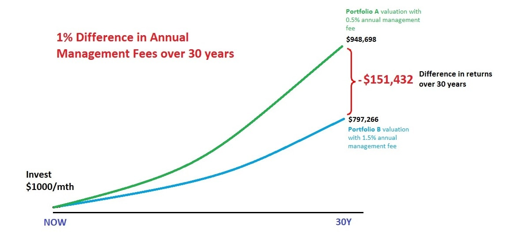

# Keep costs low

Many funds and financial advisors take a large chunk of your money each year as a fee for managing your investment.

## Index vs Active

Active funds are kind of like stocks in that you're gambling on performance. You're hoping that the fund you pick grows more than the others because the portfolio managers built a strong portfolio of stocks.

Active funds cost more than index funds

- Most S&P 500 index funds charge a fee of around .05%
- Active funds often charge over 1.0%, which is 20x more expensive!

Those fees are charged even if the funds lose money, and those fees compound every year.

Source: [dollardex.com: How a 1% fee could cost Millennials $151,432 in retirement savings](https://www.dollardex.com/sgn/index.cfm?current=insights/lowCostInvest)

The argument is FOR active funds is that you're paying for very smart portfolio managers that know how to outperform the market. If a fund has a 1.0% fee, but the return was 1.5% better than the market, that's a .5% win!

### A very small number of funds beat the market over several years

Data shows that active funds occasionally beat the market for a year or two, but **very few funds consistently beat the market index over the course of 10+ years.**

Source: [thecollegeinvestor.com: What Is An Index Fund? (And Is It A Good Investment Choice?](https://thecollegeinvestor.com/37486/what-is-an-index-fund/)

#### Percentage of funds that underperform the benchmark

The table below is a subset of [analysis done by SPIVA Research](https://www.spglobal.com/spdji/en/research-insights/spiva/).

The results are consistent across all 35 fund categories in the SPIVA link. **The index beats the average fund** for every category over 10 years, and 100% of the stock fund over 3 years!

| FUND CATEGORY          | COMPARISON INDEX                            | 1 YR (%) | 15 YRS (%) |
|------------------------|---------------------------------------------|----------|------------|
| All Large-Cap          | S&P 500                                     | 60.9     | 92.19      |
| All Small-Cap          | S&P SmallCap 600                            | 26.56    | 89.28      |
| All Domestic           | S&P Composite 1500                          | 72.44    | 93.51      |
| Real Estate            | S&P United States REIT                      | 91.67    | 84.85      |
| General Government     | iBoxx $ Domestic Sovereign & Sub-Sovereigns | 96.97    | 81.63      |
| General Bond           | iBoxx $ Overall                             | 43.24    | 73.91      |
| General Municipal Debt | S&P National AMT-Free Municipal Bond        | 77.78    | 69.62      |

### Resources

- [Rule #3: Control investment risk exposure](https://www.youtube.com/watch?v=mArZsJvFKY4) (Youtube)
- [Rule #4: Diversify stocks!](https://www.youtube.com/watch?v=zXnbxLtRhrU&t=170s) (Youtube)
- [Rule #6: Use index funds when possible](https://youtu.be/GF5vThMkF-U?si=BE2NZ6LweNKB_TRt) (Youtube)
- [Rule #7: Keep costs low](https://www.youtube.com/watch?v=GqQfA4xPvAo&list=PL21534875BFC50EEE&index=8) (Youtube)

## Can my financial advisor provide better returns than the market?

Maybe.


**Past performance does not guarantee future results**


From a purely `"picking stocks that perform well"` perspective, the argument against financial advisors mirrors the argument against active funds. Nobody can predict the future, and data shows that on average, even the professionals perform worse than the S&P 500.


**Disclaimer**: Financial advisors may provide value that make them worth the money for you. For example: tax advise, peace of mind, retirement and estate planning, etc.

The point made here is that financial advisors can't guarantee high returns, so be wary of paying them for that purpose


### Your broker is not your buddy

If you decide to work with a financial advisor, ensure they are a **fiduciary**. Fiduciaries are required by law to work with your best interest in mind.

### Resources

- [Broker is not your buddy](https://www.youtube.com/watch?v=PQuR3oljviw) (Youtube)
- [Is it worth it to pay for an investment advisor](https://www.personalfinanceclub.com/is-it-worth-it-to-pay-for-an-investment-advisor/)
- [Fiduciary Meaning: What Is a Fiduciary Duty?](https://www.nerdwallet.com/article/investing/fiduciary)
